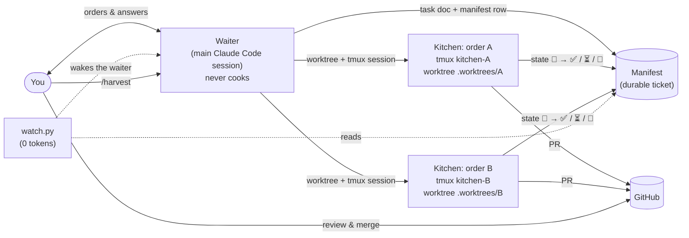

# claude-code-kitchen

**Run several Claude Code agents in parallel, each on its own task, each ending in a pull
request — while your main session stays free to talk to you.**

[Português (Brasil)](README.pt-BR.md) · [Docs](docs/) · [Changelog](CHANGELOG.md)

claude-code-kitchen is a set of [Claude Code skills](https://docs.claude.com/en/docs/claude-code/skills)
plus a few small, stdlib-only Python scripts. It turns one Claude Code session into a
**waiter** that takes your orders and a set of detached tmux sessions into a **kitchen**
that cooks them — one git worktree and one PR per order — with durable state, deterministic
gates and zero tokens spent on waiting.

It is a template, not a platform: everything project-specific lives in one small adapter
file per repo, and the rules live in plain Markdown you can read and change.

---

## The problem

A single Claude Code session doing real work has three bottlenecks:

1. **It is busy.** While it implements task A you cannot ask it about task B.
2. **It forgets.** `/clear`, a crash or a closed terminal loses what was in flight.
3. **It asks.** "Can I go ahead with the plan?" turns a 40-minute task into a day of
   ping-pong.

Running several sessions by hand fixes (1) and makes (2) worse: nobody knows which terminal
was doing what, which branch it was on, or whether it finished.

## How the kitchen works



- **Waiter** — your main session. It takes the order, writes it down, dispatches it and
  comes straight back to you. It never edits code itself.
- **Kitchen** — one detached tmux session per order (`kitchen-<id>`), running an interactive
  Claude Code in its own git worktree, working until the PR is open. You can attach to any
  kitchen and talk to it.
- **Ticket (manifest)** — a Markdown table with one row per order and its state
  (`⏸ queued · 🔄 running · ⏳ waiting on human · ✅ PR · 🚫 aborted`). It survives
  `/clear`, crashes and closed terminals; after a reboot it is what lets you reconcile.
- **Serve** — the waiter tells you when a dish is ready (PR open), paused (needs you) or
  dropped (aborted), with the PR link.
- **Harvest** — after you merge, `/harvest` removes the worktrees and branches whose merge
  it can verify, and nothing else.

What each kitchen does, in order: eligibility filters (is this task open, in this repo's
layer, unblocked, and **not already done**?) → plan with a declared **blast radius** →
independent plan review for large tasks (no human pause) → TDD on logic → deterministic
gates → commit → PR with an honest gate report and a mandatory `## Not verified` section.

## Quickstart

Requirements: [Claude Code](https://docs.claude.com/en/docs/claude-code), `git`, `tmux`,
`python3` (3.10+), and the [GitHub CLI](https://cli.github.com/) (`gh`) logged in.

1. Clone: `git clone https://github.com/Fabiano-Arthur/claude-code-kitchen.git`
2. Preview the install: `./claude-code-kitchen/install.sh --dry-run`
3. Install (symlinks into `~/.claude/skills`). If you already have a skill with the same
   name (`plan`, `qa`…), it asks before moving yours to `<name>.bak-<timestamp>`:
   `./claude-code-kitchen/install.sh`
4. In your project, copy the adapter: `mkdir -p .claude && cp <kitchen>/examples/adapter.md .claude/orchestrator.md`, then edit it.
5. Keep kitchen files out of your diffs: `printf '.kitchen/\n.worktrees/\n' >> .git/info/exclude`
6. Check the machine: `python3 ~/.claude/skills/orchestrate/scripts/doctor.py .`
7. Write a task: `/plan add rate limiting to the login endpoint` (or copy `examples/task.md`).
8. Cook it: `/dotask <slug>` — then keep talking to the waiter; you will be told when the PR
   is up.
9. After merging: `/harvest`.

Want to try it without touching a real repo first? Follow
[`examples/demo-project`](examples/demo-project/README.md).

## Commands

| command | what it does |
|---|---|
| `/plan` | brainstorm → task docs (What · Why · Acceptance criteria · Technical notes); `--problem` records a bug without stopping anyone |
| `/dotask <slug>` | one task → kitchen → watched until the PR is open |
| `/orchestrate <ids>` | several tasks → routing, collisions, estimate, manifest, dispatch (with a cap) |
| `/execute <id>` | the engine of one unit (what a kitchen session runs) |
| `/qa <target>` | a budgeted QA run: facts → case matrix → gates → verdict with evidence |
| `/harvest` | after merging: clean up what was verifiably merged |

## Concepts

| concept | in one line | more |
|---|---|---|
| **Adapter** | `.claude/orchestrator.md` in each repo: base branch, test commands, layers, forbidden patterns, caps. Skills never hard-code project values. | [docs/adapter.md](docs/adapter.md) |
| **Scarce resource** | what two tasks cannot use at once (a dev-server port, a device, your eyes). Tasks that need it run inline with you, one at a time. | [docs/architecture.md](docs/architecture.md) |
| **Blast radius** | every plan lists the files it will touch per layer; the real diff is reconciled against it before the commit. | [docs/gates.md](docs/gates.md) |
| **Gates** | `forbidden_in_diff` (added lines only, comments ignored) · independent plan review · blast-radius reconciliation · honest gate report. | [docs/gates.md](docs/gates.md) |
| **Manifest** | the durable ticket; each kitchen writes only its own row. | [docs/manifest.md](docs/manifest.md) |
| **Detour rule** | a bug found mid-task is recorded with `/plan --problem`, not fixed; the task carries on. | [docs/architecture.md](docs/architecture.md) |
| **Hibernation** | a finished kitchen writes its session id to `.kitchen/done`; it can be killed to free RAM and revived with `claude --resume`. | [docs/manifest.md](docs/manifest.md) |

## Security: `--dangerously-skip-permissions`

**Read this before dispatching anything.** A kitchen session runs detached, so nobody is
there to approve permission prompts; any prompt would freeze it silently. The kitchen
therefore starts Claude Code with `--dangerously-skip-permissions`. That means **the agent
can run any command your user can run**, without asking.

What that implies:

- Anything reachable from your shell is reachable by the agent: your files, your SSH keys,
  your cloud credentials, your `gh` token, every environment variable.
- The agent reads task docs, code, command output and web pages. **Any of that can contain
  instructions** (prompt injection). A task doc copied from an untrusted issue is an attack
  surface.
- The adapter's command fields (`prepare_worktree`, `post_commit`, `status_push`, `gh`,
  `tests.allowed`) are run by the agent. Review changes to `.claude/orchestrator.md` like
  code — a PR that edits it edits what your kitchens execute.
- The skills are symlinks into your clone of this repo, so `git pull` changes the
  instructions an unattended agent follows. Update deliberately: check out a release tag
  and read the diff first.

Mitigations, strongest first:

1. **Run the kitchen inside a sandbox** — a dev container or VM that holds only the repo and
   a narrowly scoped token. This is the only mitigation that contains a compromised agent.
2. **Least-privilege credentials.** Give `gh` a fine-grained token limited to the repos you
   orchestrate, with no admin scope. Keep production credentials out of the environment the
   kitchen inherits.
3. **Branch protection on the remote.** Require PR review on your base branches; forbid
   force-push. The skills never push to a base branch nor force-push, but the remote is what
   actually enforces it.
4. **No MCP servers by default** — kitchens start with `--strict-mcp-config`, so a
   third-party MCP server cannot reach them unless you declare it for that unit.
5. **Trusted input only.** Write task docs yourself (or with `/plan`); do not paste
   unreviewed issue text into them. With the `github-issues` backlog on a public repo,
   dispatch only issues opened by collaborators you trust — see
   [integrations.md](docs/integrations.md#github-issues).
6. **Review every PR.** The kitchen opens PRs; merging is always yours.

If none of that fits your environment, run `/execute --inline` instead: same flow, in your
main session, with normal permission prompts.

## FAQ

**Is this an official Anthropic project?** No. It is a community template built on public
Claude Code features (skills, `--resume`, `--strict-mcp-config`).

**Why tmux and not the built-in subagent tool?** A tmux session survives `/clear` and a
closed terminal, can be attached to and talked to, and can run for hours on its own. The
in-session subagent tool is used only for short consultations (the plan and pre-PR
reviewers), where a returned answer is what you want.

**How many kitchens can run at once?** As many as your machine and your account's rate
limit allow. Set `max_parallel` in the adapter and the dispatcher keeps at most that many
alive, starting the next when one finishes.

**Does it work without GitHub?** The loop ends at a PR, so the PR step needs `gh`. Without
it, a kitchen stops at the push and hands you the compare URL.

**Does it need a tracker (Jira, Linear, ClickUp…)?** No. The default backlog is a folder of
Markdown task docs. Tracker integrations are optional; see
[docs/integrations.md](docs/integrations.md).

**What does a kitchen cost?** Each kitchen is a full Claude Code session. `model_by_size` in
the adapter sends small tasks to a cheaper model; the watcher and dispatcher spend zero
tokens.

**My kitchen is stuck on its first shell command.** See
[docs/troubleshooting.md](docs/troubleshooting.md) — it is almost always a terminal
integration hooking the non-interactive shell.

**Does it work on Windows?** Not natively (tmux). WSL2 should work but is untested.

## Repository layout

```
skills/            the six skills (orchestrate holds CORE.md, the shared rulebook)
  orchestrate/scripts/  dispatcher.py · doctor.py · gate_diff.py · watch.py
  qa/scripts/           qa_preflight · qa_matrix · qa_budget · qa_report · qa_filter · qa_mutation · qa_watcher
shell/             opt-in zsh guard for non-human shells
examples/          adapter, QA adapter, task doc, demo project
docs/              architecture, adapter, manifest, gates, QA, integrations, troubleshooting
tests/             pytest suite (runs every script's --selftest too)
install.sh         symlink installer (--dry-run, --uninstall)
```

## Contributing

Issues and PRs are welcome — see [CONTRIBUTING.md](CONTRIBUTING.md). Security reports:
[SECURITY.md](SECURITY.md).

## License

[MIT](LICENSE) © 2026 Fabiano Arthur
