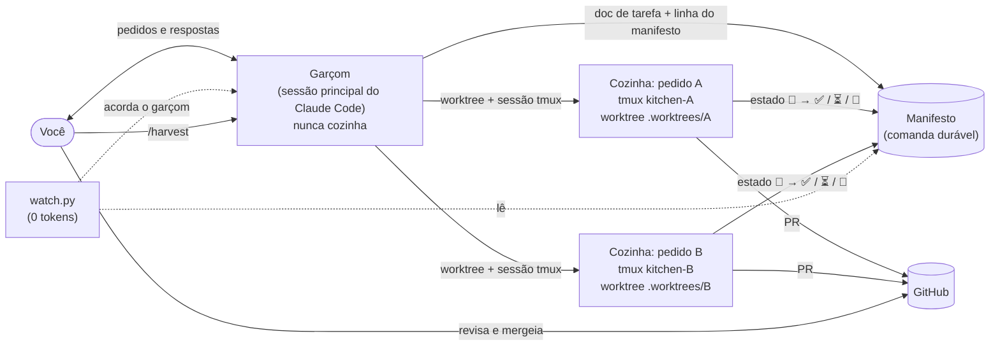

# claude-code-kitchen

**Rode vários agentes do Claude Code em paralelo, cada um na sua tarefa, cada um terminando
num pull request — enquanto a sua sessão principal continua livre para conversar com você.**

[English](README.md) · [Documentação (em inglês)](docs/) · [Changelog](CHANGELOG.md)

O claude-code-kitchen é um conjunto de [skills do Claude Code](https://docs.claude.com/en/docs/claude-code/skills)
com alguns scripts Python pequenos, que só usam a biblioteca padrão. Ele transforma uma
sessão do Claude Code num **garçom**, que anota os seus pedidos, e um grupo de sessões tmux
em segundo plano numa **cozinha**, que prepara esses pedidos: um worktree e um PR por
pedido. Tudo com estado que não se perde, gates determinísticos e nenhum token gasto com
espera.

É um template, não uma plataforma: tudo o que é específico do projeto fica num pequeno
arquivo de adapter em cada repositório, e as regras ficam em Markdown puro, que você pode
ler e alterar.

---

## Equivalência de nomes: português → inglês

As skills e os comandos estão em inglês. Se você já usava a versão original do fluxo, em
português, a correspondência é esta:

| português | inglês | o que faz |
|---|---|---|
| garçom | waiter | a sessão principal; anota, despacha, serve; nunca cozinha |
| cozinha | kitchen | uma sessão tmux por pedido, no próprio worktree, até o PR |
| pedido | order | um doc de tarefa (uma unidade de trabalho) |
| comanda / manifesto | ticket / manifest | o registro durável do que está em andamento |
| servir | serve | avisar que o prato ficou pronto (PR), empacou (precisa de você) ou foi descartado (abortado) |
| `/plan` | `/plan` | brainstorm → docs de tarefa; `--problema` → `--problem` |
| `/dotask` | `/dotask` | uma tarefa → cozinha → vigiada até o PR abrir |
| `/orquestrar` | `/orchestrate` | várias tarefas → roteamento, colisões, manifesto, despacho |
| `/executar` | `/execute` | o motor de uma unidade (o que a cozinha roda) |
| `/qa` | `/qa` | rodada de QA com orçamento: fatos → matriz → gates → veredito |
| `/colher` | `/harvest` | depois do merge: limpa o que foi mergeado de fato |
| `NUCLEO.md` | `CORE.md` | as regras que todas as skills seguem |
| `.claude/orquestrador.md` | `.claude/orchestrator.md` | o adapter do repositório |
| Raio de alcance | blast radius | os arquivos que o plano declara que vai tocar |
| regra do desvio | detour rule | bug encontrado no meio do caminho vira registro, não conserto |
| recurso escasso | scarce resource | o que duas tarefas não podem usar ao mesmo tempo |
| `.orq/`, `orq-<ID>` | `.kitchen/`, `kitchen-<ID>` | pasta de despacho e nome da sessão tmux |
| `--autoteste` | `--selftest` | teste embutido de cada script |

## O problema

Uma única sessão do Claude Code fazendo trabalho de verdade esbarra em três gargalos:

1. **Ela fica ocupada.** Enquanto implementa a tarefa A, você não consegue perguntar nada
   sobre a tarefa B.
2. **Ela esquece.** Um `/clear`, um crash ou um terminal fechado e lá se vai o que estava em
   andamento.
3. **Ela pergunta.** "Posso seguir com o plano?" transforma uma tarefa de 40 minutos num dia
   inteiro de pingue-pongue.

Rodar várias sessões à mão resolve o (1) e piora o (2): ninguém sabe qual terminal estava
fazendo o quê, em qual branch, nem se terminou.

## Como a cozinha funciona



- **Garçom** — a sua sessão principal. Anota o pedido, manda para a cozinha e volta na hora
  para você. Nunca mexe em código.
- **Cozinha** — uma sessão tmux em segundo plano por pedido (`kitchen-<id>`), com um Claude
  Code interativo rodando no próprio worktree e trabalhando até o PR abrir. Você pode entrar
  em qualquer cozinha e conversar com ela.
- **Comanda (manifesto)** — uma tabela em Markdown com uma linha por pedido e o estado de
  cada um (`⏸ na fila · 🔄 rodando · ⏳ aguarda humano · ✅ PR · 🚫 abortado`). Sobrevive a
  `/clear`, crash e terminal fechado; se a máquina reiniciar, é com ela que você confere o
  que ficou pela metade.
- **Servir** — o garçom avisa, com o link do PR, quando o prato fica pronto (PR aberto),
  quando empaca (precisa de você) ou quando é descartado (abortado).
- **Colher** — depois do merge, o `/harvest` remove os worktrees e as branches cujo merge
  ele consegue comprovar, e mais nada.

O que cada cozinha faz, nesta ordem: filtros de elegibilidade (a tarefa está aberta, é da
camada deste repositório, não está bloqueada e **ainda não foi feita**?) → plano com o
**raio de alcance** declarado → revisão independente do plano nas tarefas grandes (sem
parar para esperar ninguém) → TDD na lógica → gates determinísticos → commit → PR com um
relatório de gates honesto e uma seção `## Not verified` obrigatória.

## Início rápido

Você vai precisar de: [Claude Code](https://docs.claude.com/en/docs/claude-code), `git`,
`tmux`, `python3` (3.10+) e o [GitHub CLI](https://cli.github.com/) (`gh`) com login feito.

1. Clone: `git clone https://github.com/Fabiano-Arthur/claude-code-kitchen.git`
2. Veja o que a instalação faria: `./claude-code-kitchen/install.sh --dry-run`
3. Instale (symlinks em `~/.claude/skills`, com backup do que estiver no caminho):
   `./claude-code-kitchen/install.sh`
4. No seu projeto, copie o adapter: `mkdir -p .claude && cp <kitchen>/examples/adapter.md .claude/orchestrator.md` e depois edite o arquivo.
5. Tire os arquivos da cozinha dos seus diffs: `printf '.kitchen/\n.worktrees/\n' >> .git/info/exclude`
6. Confira a máquina: `python3 ~/.claude/skills/orchestrate/scripts/doctor.py .`
7. Escreva uma tarefa: `/plan adicionar rate limit no endpoint de login` (ou copie `examples/task.md`).
8. Mande para a cozinha: `/dotask <slug>` — e siga conversando com o garçom; ele avisa
   quando o PR subir.
9. Depois do merge: `/harvest`.

Quer experimentar antes de mexer num repositório de verdade? Siga o
[`examples/demo-project`](examples/demo-project/README.md) (em inglês).

## Comandos

| comando | o que faz |
|---|---|
| `/plan` | brainstorm → docs de tarefa (What · Why · Acceptance criteria · Technical notes); `--problem` registra um bug sem parar ninguém |
| `/dotask <slug>` | uma tarefa → cozinha → vigiada até o PR abrir |
| `/orchestrate <ids>` | várias tarefas → roteamento, colisões, estimativa, manifesto, despacho (com limite) |
| `/execute <id>` | o motor de uma unidade (o que a sessão da cozinha roda) |
| `/qa <alvo>` | rodada de QA com orçamento: fatos → matriz de casos → gates → veredito com evidência |
| `/harvest` | depois do merge: limpa só o que comprovadamente foi mergeado |

## Conceitos

| conceito | em uma linha | mais |
|---|---|---|
| **Adapter** | `.claude/orchestrator.md` em cada repositório: branch base, comandos de teste, camadas, padrões proibidos, limites. As skills nunca deixam valor de projeto hardcoded. | [docs/adapter.md](docs/adapter.md) |
| **Recurso escasso** | o que duas tarefas não podem usar ao mesmo tempo (porta do dev server, um dispositivo, os seus olhos). Tarefa que depende dele roda inline, com você presente, uma de cada vez. | [docs/architecture.md](docs/architecture.md) |
| **Raio de alcance** | todo plano lista, por camada, os arquivos que vai tocar; o diff real é conferido com essa lista antes do commit. | [docs/gates.md](docs/gates.md) |
| **Gates** | `forbidden_in_diff` (só linhas adicionadas, ignorando comentários) · revisão independente do plano · conferência do raio de alcance · relatório de gates honesto. | [docs/gates.md](docs/gates.md) |
| **Manifesto** | a comanda durável; cada cozinha escreve só a própria linha. | [docs/manifest.md](docs/manifest.md) |
| **Regra do desvio** | bug encontrado no meio da tarefa é registrado com `/plan --problem`, não consertado; a tarefa segue. | [docs/architecture.md](docs/architecture.md) |
| **Hibernação** | a cozinha que terminou grava o id da sessão em `.kitchen/done`; dá para encerrá-la para liberar RAM e retomá-la depois com `claude --resume`. | [docs/manifest.md](docs/manifest.md) |

## Segurança: `--dangerously-skip-permissions`

**Leia isto antes de mandar qualquer coisa para a cozinha.** A sessão da cozinha roda em
segundo plano, então não tem ninguém lá para aprovar prompt de permissão; qualquer prompt
desses a deixaria travada sem avisar. Por isso a cozinha inicia o Claude Code com
`--dangerously-skip-permissions`. Na prática, **o agente pode rodar qualquer comando que o
seu usuário do sistema possa rodar**, sem perguntar.

O que isso significa:

- Tudo o que o seu shell alcança, o agente alcança: seus arquivos, suas chaves SSH, suas
  credenciais de nuvem, o token do `gh`, toda variável de ambiente.
- O agente lê docs de tarefa, código, saída de comando e páginas web. **Qualquer uma dessas
  coisas pode trazer instruções** (prompt injection). Um doc de tarefa copiado de uma issue
  em que você não confia é superfície de ataque.

Mitigações, da mais forte para a mais fraca:

1. **Rode a cozinha dentro de um sandbox** — um dev container ou uma VM que tenha só o
   repositório e um token de escopo mínimo. É a única mitigação que segura um agente
   comprometido.
2. **Credenciais de menor privilégio.** Dê ao `gh` um token fine-grained limitado aos
   repositórios que você orquestra, sem escopo de admin. Deixe credencial de produção fora
   do ambiente que a cozinha herda.
3. **Proteção de branch no remoto.** Exija revisão de PR nas branches base e proíba
   force-push. As skills nunca fazem push na base nem force-push, mas quem garante isso de
   verdade é o remoto.
4. **Nenhum servidor MCP por padrão** — as cozinhas sobem com `--strict-mcp-config`, então um
   servidor MCP de terceiro só chega nelas se você o declarar para aquela unidade.
5. **Só entrada confiável.** Escreva os docs de tarefa você mesmo (ou com `/plan`); não cole
   texto de issue sem revisar.
6. **Revise todo PR.** A cozinha abre o PR; o merge é sempre seu.

Se nada disso for viável no seu ambiente, use `/execute --inline`: o mesmo fluxo, na
sessão principal, com os prompts de permissão de sempre.

## Perguntas frequentes

**É um projeto oficial da Anthropic?** Não. É um template da comunidade feito em cima de
recursos públicos do Claude Code (skills, `--resume`, `--strict-mcp-config`).

**Por que tmux e não a ferramenta nativa de subagentes?** Uma sessão tmux sobrevive a
`/clear` e a terminal fechado, deixa você entrar nela e conversar, e aguenta horas rodando
sozinha. A ferramenta nativa de subagentes só entra em consultas curtas (os revisores do
plano e do pré-PR), quando o que você quer é só a resposta.

**Quantas cozinhas rodam ao mesmo tempo?** Quantas a sua máquina e o rate limit da sua conta
aguentarem. Defina `max_parallel` no adapter e o dispatcher mantém no máximo essa
quantidade rodando, subindo a próxima quando uma termina.

**Funciona sem GitHub?** O ciclo termina num PR, então essa etapa precisa do `gh`. Sem ele, a
cozinha para no push e entrega a URL de comparação do GitHub.

**Precisa de um gerenciador de tarefas (Jira, Linear, ClickUp…)?** Não. O backlog padrão é
uma pasta de docs de tarefa em Markdown. A integração com gerenciadores é opcional; veja
[docs/integrations.md](docs/integrations.md).

**Quanto custa uma cozinha?** Cada cozinha é uma sessão completa do Claude Code. O
`model_by_size` do adapter manda tarefa pequena para um modelo mais barato; o watcher e o
dispatcher não gastam nenhum token.

**A minha cozinha travou no primeiro comando de shell.** Veja
[docs/troubleshooting.md](docs/troubleshooting.md) — quase sempre é alguma integração do
terminal se metendo no shell não interativo.

**Funciona no Windows?** Não de forma nativa (por causa do tmux). No WSL2 deve funcionar,
mas ninguém testou ainda.

## Estrutura do repositório

```
skills/            as seis skills (a orchestrate guarda o CORE.md, as regras comuns)
  orchestrate/scripts/  dispatcher.py · doctor.py · gate_diff.py · watch.py
  qa/scripts/           qa_preflight · qa_matrix · qa_budget · qa_report · qa_filter · qa_mutation · qa_watcher
shell/             proteção opcional do zsh para shells que não são de humanos
examples/          adapter, adapter de QA, doc de tarefa, projeto de demonstração
docs/              arquitetura, adapter, manifesto, gates, QA, integrações, solução de problemas
tests/             testes com pytest (rodam também o --selftest de cada script)
install.sh         instalador por symlink (--dry-run, --uninstall)
```

## Contribuindo

Issues e PRs são bem-vindos — veja o [CONTRIBUTING.md](CONTRIBUTING.md). Para reportar
uma vulnerabilidade: [SECURITY.md](SECURITY.md).

## Licença

[MIT](LICENSE) © 2026 Fabiano Arthur
