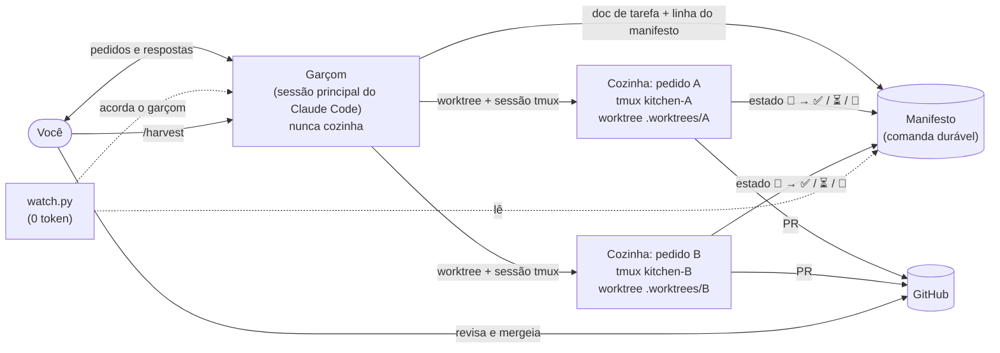

# claude-code-kitchen

**Rode vários agentes do Claude Code em paralelo, cada um na sua tarefa, cada um terminando
num pull request — enquanto a sua sessão principal continua livre para conversar com você.**

[English](README.md) · [Documentação (em inglês)](docs/) · [Changelog](CHANGELOG.md)

O claude-code-kitchen é um conjunto de [skills do Claude Code](https://docs.claude.com/en/docs/claude-code/skills)
mais alguns scripts Python pequenos, só com a biblioteca padrão. Ele transforma uma sessão
do Claude Code num **garçom** que anota os seus pedidos, e um conjunto de sessões tmux
destacadas numa **cozinha** que prepara esses pedidos — um worktree git e um PR por
pedido — com estado durável, gates determinísticos e zero token gasto esperando.

É um modelo, não uma plataforma: tudo o que é específico do projeto fica num arquivo
pequeno de adapter por repositório, e as regras ficam em Markdown puro, que você lê e muda.

---

## Nomes dos comandos: português → inglês

As skills e os comandos são em inglês. Se você conhece a versão original em português do
fluxo, a equivalência é esta:

| português | inglês | o que faz |
|---|---|---|
| garçom | waiter | a sessão principal; anota, despacha, serve; nunca cozinha |
| cozinha | kitchen | uma sessão tmux por pedido, no próprio worktree, até o PR |
| pedido | order | um doc de tarefa (uma unidade de trabalho) |
| comanda / manifesto | ticket / manifest | o registro durável do que está em voo |
| servir | serve | avisar que o prato ficou pronto (PR), parou (precisa de você) ou caiu (abortado) |
| `/plan` | `/plan` | brainstorm → docs de tarefa; `--problema` → `--problem` |
| `/dotask` | `/dotask` | uma tarefa → cozinha → vigiada até o PR abrir |
| `/orquestrar` | `/orchestrate` | várias tarefas → roteamento, colisões, manifesto, despacho |
| `/executar` | `/execute` | o motor de uma unidade (o que a cozinha roda) |
| `/qa` | `/qa` | corrida de QA com orçamento: fatos → matriz → gates → veredito |
| `/colher` | `/harvest` | depois do merge: limpa o que foi mergeado de verdade |
| `NUCLEO.md` | `CORE.md` | o regulamento compartilhado por todas as skills |
| `.claude/orquestrador.md` | `.claude/orchestrator.md` | o adapter do repositório |
| Raio de alcance | blast radius | os arquivos que o plano declara que vai tocar |
| regra do desvio | detour rule | bug achado no meio vira registro, não conserto |
| recurso escasso | scarce resource | o que duas tarefas não podem usar ao mesmo tempo |
| `.orq/`, `orq-<ID>` | `.kitchen/`, `kitchen-<ID>` | pasta de despacho e nome da sessão tmux |
| `--autoteste` | `--selftest` | teste embutido de cada script |

## O problema

Uma sessão única do Claude Code fazendo trabalho de verdade tem três gargalos:

1. **Ela fica ocupada.** Enquanto implementa a tarefa A, você não consegue perguntar nada
   sobre a tarefa B.
2. **Ela esquece.** Um `/clear`, um crash ou um terminal fechado perdem o que estava em voo.
3. **Ela pergunta.** "Posso seguir com o plano?" transforma uma tarefa de 40 minutos num dia
   de pingue-pongue.

Rodar várias sessões à mão resolve o (1) e piora o (2): ninguém sabe qual terminal estava
fazendo o quê, em qual branch, nem se terminou.

## Como a cozinha funciona



- **Garçom** — a sua sessão principal. Anota o pedido, registra, despacha e volta na hora
  para você. Nunca edita código.
- **Cozinha** — uma sessão tmux destacada por pedido (`kitchen-<id>`), rodando um Claude Code
  interativo no próprio worktree git, trabalhando até o PR abrir. Você pode anexar a
  qualquer cozinha e conversar com ela.
- **Comanda (manifesto)** — uma tabela em Markdown com uma linha por pedido e o estado dele
  (`⏸ na fila · 🔄 rodando · ⏳ aguarda humano · ✅ PR · 🚫 abortado`). Sobrevive a `/clear`,
  crash e terminal fechado; depois de um reboot, é ele que permite reconciliar.
- **Servir** — o garçom avisa quando o prato fica pronto (PR aberto), para (precisa de você)
  ou cai (abortado), com o link do PR.
- **Colher** — depois do merge, `/harvest` remove os worktrees e branches cujo merge ele
  consegue verificar, e mais nada.

O que cada cozinha faz, em ordem: filtros de elegibilidade (a tarefa está aberta, é da
camada deste repositório, está desbloqueada e **ainda não foi feita**?) → plano com
**raio de alcance** declarado → revisão independente do plano nas tarefas grandes (sem
pausa para humano) → TDD em lógica → gates determinísticos → commit → PR com relatório de
gates honesto e uma seção `## Not verified` obrigatória.

## Início rápido

Requisitos: [Claude Code](https://docs.claude.com/en/docs/claude-code), `git`, `tmux`,
`python3` (3.10+) e o [GitHub CLI](https://cli.github.com/) (`gh`) autenticado.

1. Clone: `git clone https://github.com/Fabiano-Arthur/claude-code-kitchen.git`
2. Veja o que a instalação faria: `./claude-code-kitchen/install.sh --dry-run`
3. Instale (symlinks em `~/.claude/skills`, com backup do que estiver no caminho):
   `./claude-code-kitchen/install.sh`
4. No seu projeto, copie o adapter: `mkdir -p .claude && cp <kitchen>/examples/adapter.md .claude/orchestrator.md`, e edite.
5. Tire os arquivos da cozinha dos seus diffs: `printf '.kitchen/\n.worktrees/\n' >> .git/info/exclude`
6. Confira a máquina: `python3 ~/.claude/skills/orchestrate/scripts/doctor.py .`
7. Escreva uma tarefa: `/plan adicionar rate limit no endpoint de login` (ou copie `examples/task.md`).
8. Mande para a cozinha: `/dotask <slug>` — e continue conversando com o garçom; ele avisa
   quando o PR subir.
9. Depois do merge: `/harvest`.

Quer testar antes de mexer num repositório de verdade? Siga o
[`examples/demo-project`](examples/demo-project/README.md) (em inglês).

## Comandos

| comando | o que faz |
|---|---|
| `/plan` | brainstorm → docs de tarefa (What · Why · Acceptance criteria · Technical notes); `--problem` registra um bug sem parar ninguém |
| `/dotask <slug>` | uma tarefa → cozinha → vigiada até o PR abrir |
| `/orchestrate <ids>` | várias tarefas → roteamento, colisões, estimativa, manifesto, despacho (com teto) |
| `/execute <id>` | o motor de uma unidade (o que a sessão da cozinha roda) |
| `/qa <alvo>` | corrida de QA com orçamento: fatos → matriz de casos → gates → veredito com evidência |
| `/harvest` | depois do merge: limpa o que foi mergeado de forma verificável |

## Conceitos

| conceito | em uma linha | mais |
|---|---|---|
| **Adapter** | `.claude/orchestrator.md` em cada repositório: branch base, comandos de teste, camadas, padrões proibidos, tetos. As skills nunca cravam valor de projeto. | [docs/adapter.md](docs/adapter.md) |
| **Recurso escasso** | o que duas tarefas não podem usar ao mesmo tempo (porta do dev server, um dispositivo, os seus olhos). Tarefa que precisa dele roda inline com você, uma por vez. | [docs/architecture.md](docs/architecture.md) |
| **Raio de alcance** | todo plano lista, por camada, os arquivos que vai tocar; o diff real é reconciliado contra essa lista antes do commit. | [docs/gates.md](docs/gates.md) |
| **Gates** | `forbidden_in_diff` (só linhas adicionadas, comentário ignorado) · revisão independente do plano · reconciliação do raio · relatório de gates honesto. | [docs/gates.md](docs/gates.md) |
| **Manifesto** | a comanda durável; cada cozinha escreve só a própria linha. | [docs/manifest.md](docs/manifest.md) |
| **Regra do desvio** | bug achado no meio da tarefa é registrado com `/plan --problem`, não consertado; a tarefa segue. | [docs/architecture.md](docs/architecture.md) |
| **Hibernação** | a cozinha que terminou grava o session id em `.kitchen/done`; dá para matá-la e liberar RAM, e ressuscitar com `claude --resume`. | [docs/manifest.md](docs/manifest.md) |

## Segurança: `--dangerously-skip-permissions`

**Leia isto antes de despachar qualquer coisa.** A sessão da cozinha roda destacada, então
ninguém está lá para aprovar prompt de permissão; qualquer prompt a congelaria em silêncio.
Por isso a cozinha abre o Claude Code com `--dangerously-skip-permissions`. Isso quer dizer
que **o agente pode rodar qualquer comando que o seu usuário pode**, sem perguntar.

O que isso implica:

- Tudo o que o seu shell alcança, o agente alcança: seus arquivos, suas chaves SSH, suas
  credenciais de nuvem, o token do `gh`, toda variável de ambiente.
- O agente lê docs de tarefa, código, saída de comando e páginas web. **Qualquer um desses
  pode conter instruções** (prompt injection). Um doc de tarefa copiado de uma issue não
  confiável é superfície de ataque.

Mitigações, da mais forte para a mais fraca:

1. **Rode a cozinha dentro de um sandbox** — um dev container ou uma VM que tenha só o
   repositório e um token de escopo mínimo. É a única mitigação que contém um agente
   comprometido.
2. **Credenciais de menor privilégio.** Dê ao `gh` um token fine-grained limitado aos
   repositórios que você orquestra, sem escopo de admin. Deixe credencial de produção fora
   do ambiente que a cozinha herda.
3. **Proteção de branch no remoto.** Exija revisão de PR nas branches base e proíba
   force-push. As skills nunca fazem push na base nem force-push, mas quem garante de fato é
   o remoto.
4. **Nenhum servidor MCP por padrão** — as cozinhas sobem com `--strict-mcp-config`, então um
   MCP de terceiro não as alcança, a não ser que você o declare para aquela unidade.
5. **Só entrada confiável.** Escreva os docs de tarefa você mesmo (ou com `/plan`); não cole
   texto de issue sem revisar.
6. **Revise todo PR.** A cozinha abre o PR; o merge é sempre seu.

Se nada disso cabe no seu ambiente, use `/execute --inline`: mesmo fluxo, na sessão
principal, com os prompts de permissão normais.

## Perguntas frequentes

**É um projeto oficial da Anthropic?** Não. É um modelo da comunidade construído sobre
recursos públicos do Claude Code (skills, `--resume`, `--strict-mcp-config`).

**Por que tmux e não a ferramenta de subagente embutida?** Uma sessão tmux sobrevive a
`/clear` e a terminal fechado, aceita que você anexe e converse com ela, e roda horas
sozinha. A ferramenta de subagente embutida só é usada em consultas curtas (os revisores do
plano e do pré-PR), em que o que se quer é uma resposta de volta.

**Quantas cozinhas rodam ao mesmo tempo?** Quantas a sua máquina e o rate limit da sua conta
aguentarem. Defina `max_parallel` no adapter e o despachante mantém no máximo esse número
vivo, subindo a próxima quando uma termina.

**Funciona sem GitHub?** O ciclo termina num PR, então essa etapa precisa do `gh`. Sem ele, a
cozinha para no push e entrega a URL de comparação.

**Precisa de um gerenciador de tarefas (Jira, Linear, ClickUp…)?** Não. O backlog padrão é
uma pasta de docs de tarefa em Markdown. As integrações são opcionais; veja
[docs/integrations.md](docs/integrations.md).

**Quanto custa uma cozinha?** Cada cozinha é uma sessão completa do Claude Code. O
`model_by_size` do adapter manda tarefa pequena para um modelo mais barato; o vigia e o
despachante gastam zero token.

**A minha cozinha travou no primeiro comando de shell.** Veja
[docs/troubleshooting.md](docs/troubleshooting.md) — quase sempre é uma integração do
terminal sequestrando o shell não interativo.

**Funciona no Windows?** Não nativamente (tmux). O WSL2 deve funcionar, mas não foi testado.

## Estrutura do repositório

```
skills/            as seis skills (orchestrate guarda o CORE.md, o regulamento comum)
  orchestrate/scripts/  dispatcher.py · doctor.py · gate_diff.py · watch.py
  qa/scripts/           qa_preflight · qa_matrix · qa_budget · qa_report · qa_filter · qa_mutation · qa_watcher
shell/             guarda opcional do zsh para shells não humanos
examples/          adapter, adapter de QA, doc de tarefa, projeto de demonstração
docs/              arquitetura, adapter, manifesto, gates, QA, integrações, solução de problemas
tests/             suíte pytest (roda também o --selftest de cada script)
install.sh         instalador por symlink (--dry-run, --uninstall)
```

## Contribuindo

Issues e PRs são bem-vindos — veja [CONTRIBUTING.md](CONTRIBUTING.md). Para relatar
vulnerabilidades: [SECURITY.md](SECURITY.md).

## Licença

[MIT](LICENSE) © 2026 Fabiano Arthur
